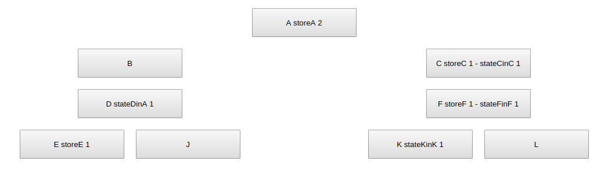

Дерево компонентов:

* Порядок монтирования и рендеринга компонентов в реакте.
* Как рендерятся компоненты с изменением состояния хранящемся в state и в store (redux).

`storeA` - состояние компонента `А` хранится в store;
`stateCinC` - состояние компонента `C` хранится в компоненте `C`;
`stateDinA` - состояние компонента `D` хранится в компоненте `A`.

Рендер компонентов при обновлении состояния (вариант хранения собственного состояния, использование классов и хранения состояния в store (использование redux и метод connect)):

* при обновлении состояния компонента, которое хранится в `store` или `state`, происходит перерендер компонента и всех потомков в дереве. Исключением являются потомки компоненты, которые хранят свое состояние в `store` и используют метод `connect`. Пример:
  * обновляется состояние компонента А => перерендер компонентов A, B, D, J. (примечание. Так как компоненты C и E хранят свои состояния в store и ипользуют метод connect, перерендер их и их потомков не происходит);
  * обновляется состояние компонента C (или в `store` или в `state`) => перерендер компонента C. (примечание. Так как компонент F хранит свое состояние в store и использует метод connect, перерендер его и его потомков не происходит);
  * обновляется состояние компонента D (оно хранится в `state` компонента A и передается компоненту D через props или context) => перерендер компонента A, B, D, J. (примечание. Так как компоненты C и E хранят свои состояния в store и ипользуют метод connect, перерендер их и их потомков не происходит).
